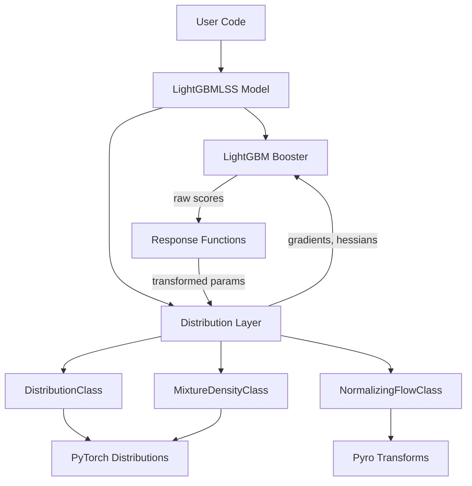
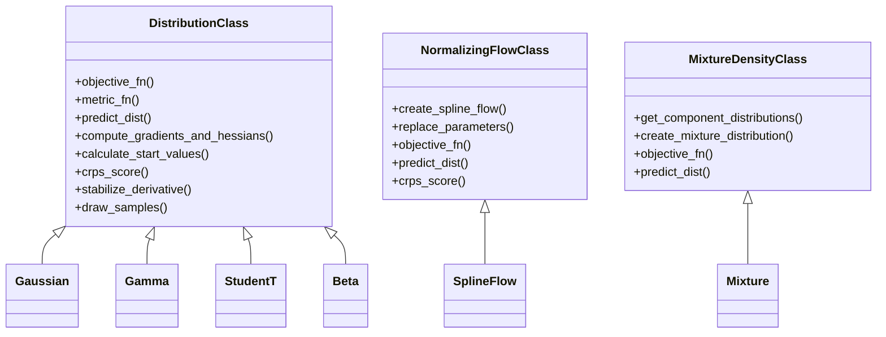
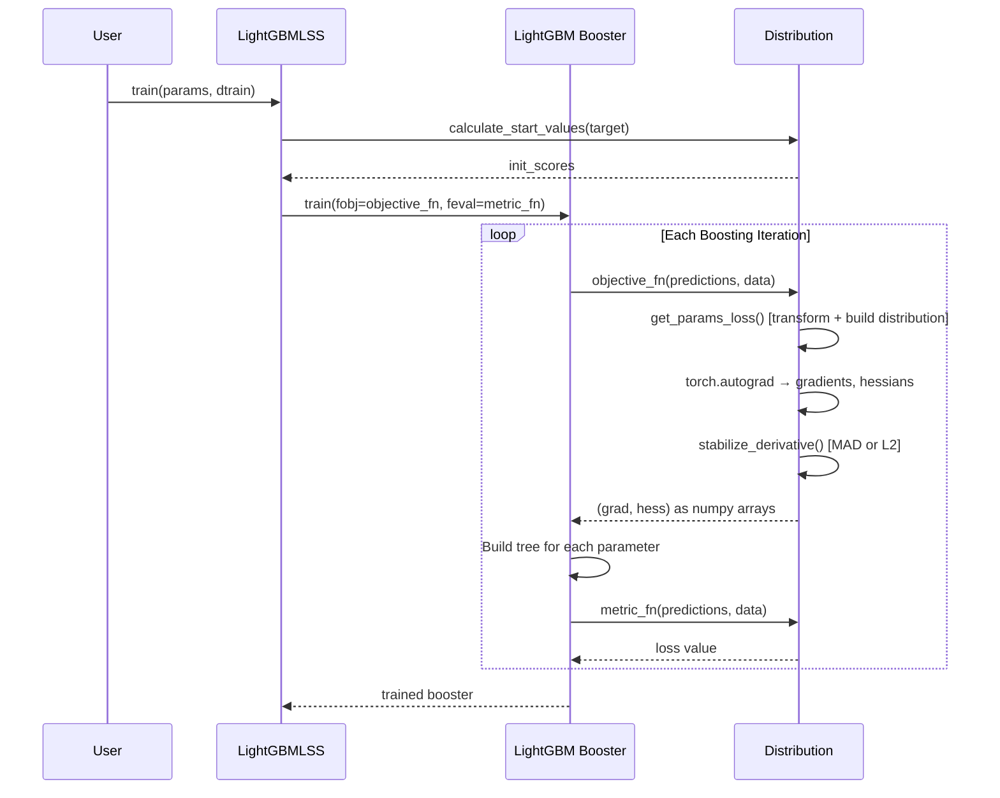
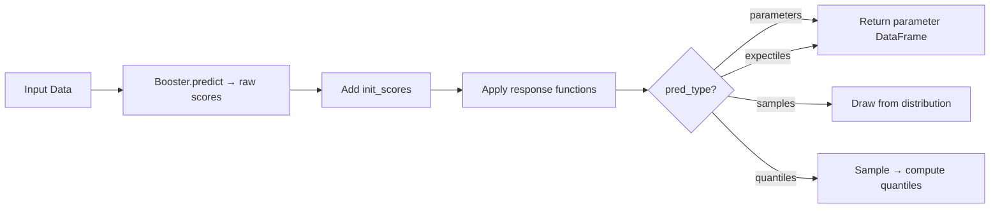

# Architecture

LightGBMLSS extends LightGBM from point predictions to full distributional modelling. Instead of estimating only the conditional mean, it estimates all parameters of a chosen distribution as functions of covariates.

## High-Level Design



## Core Components

### `LightGBMLSS` (model.py)

The main user-facing class. Wraps a LightGBM Booster and delegates distributional logic to one of the three base classes. Key methods:

| Method | Purpose |
|--------|---------|
| `train()` | Train the model with custom objective and metric functions |
| `predict()` | Generate predictions: parameters, samples, quantiles, or expectiles |
| `hyper_opt()` | Bayesian hyperparameter search via Optuna |
| `cv()` | Cross-validation with distributional objective |
| `plot()` | SHAP-based feature importance for each distributional parameter |
| `save_model()` / `load_model()` | Persistence via pickle |

### Distribution Base Classes

LightGBMLSS uses three base classes, each providing `objective_fn`, `metric_fn`, `predict_dist`, and gradient/Hessian computation:



- **DistributionClass** (`distribution_utils.py`): Standard parametric distributions (Gaussian, Gamma, StudentT, Beta, Weibull, etc.). Maps LightGBM raw scores through response functions to distribution parameters, then uses PyTorch distributions for likelihood and sampling.

- **NormalizingFlowClass** (`flow_utils.py`): Spline-based normalizing flows via Pyro. Learns flexible invertible transformations of a base distribution, enabling modelling of complex and multi-modal densities.

- **MixtureDensityClass** (`mixture_distribution_utils.py`): Mixture density models. Combines M component distributions with learned mixing weights via Gumbel-Softmax.

### Response Functions (utils.py)

Map unbounded raw LightGBM scores to valid parameter ranges:

| Function | Maps to | Used for |
|----------|---------|----------|
| `identity_fn` | (-inf, inf) | Location parameters (mean) |
| `exp_fn` | (0, inf) | Scale parameters (variance) |
| `softplus_fn` | (0, inf) | Smooth positive parameters |
| `sigmoid_fn` | (0, 1) | Probability parameters |
| `softmax_fn` | Simplex | Mixture weights |

## Training Flow



## Prediction Flow



## Loss Functions

LightGBMLSS supports two loss functions:

- **NLL** (Negative Log-Likelihood): Standard maximum likelihood. Gradients and Hessians computed via `torch.autograd`.
- **CRPS** (Continuous Ranked Probability Score): Sample-based scoring rule. Uses the energy form: `E|X-y| - 0.5*E|X-X'|`. When CRPS is used, Hessians are set to 1 (CRPS is not twice differentiable).

## Directory Structure

```
lightgbmlss/
├── model.py                    # LightGBMLSS class (train, predict, hyper_opt)
├── utils.py                    # Response functions (exp, softplus, sigmoid, etc.)
├── logger.py                   # Custom LightGBM logger (suppresses warnings)
├── datasets/
│   └── data_loader.py          # Simulated dataset loaders
└── distributions/
    ├── distribution_utils.py   # Base class for parametric distributions
    ├── flow_utils.py           # Base class for normalizing flows
    ├── mixture_distribution_utils.py  # Base class for mixture densities
    ├── zero_inflated.py        # Zero-inflated distribution helpers
    ├── Gaussian.py             # Individual distribution definitions
    ├── Gamma.py                # (one file per distribution)
    ├── StudentT.py
    ├── Beta.py
    ├── SplineFlow.py
    ├── Mixture.py
    └── ...                     # 20+ distribution files total
```
